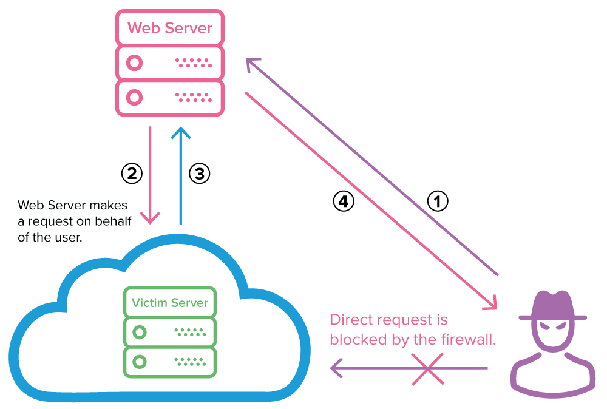
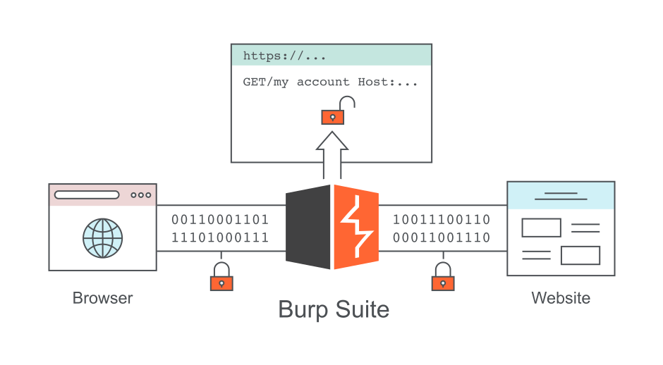

:last-update-label!:

= TP B3 - _Server-Side Request Forgery_ (SSRF)

== Introduction

Ce TP a pour objectif de mettre en évidence les problématiques liées aux *falsifications de requêtes côté serveur* (SSRF : _Server Side Request Forgery_). Cette vulnérabilité fait partie de la catégorie en tête du _OWASP Top 10:2025_, à savoir : _A01:2025 - Broken Access Control_ (contrôle d'accès défaillant).

Dans un premier temps, vous devrez comprendre le mécanisme des attaques. Dans un second temps, l'objectif est de réaliser des preuves de concept d'attaques sur une application web vulnérable.

== Présentation de la vulnérabilité

Les vulnérabilités de type SSRF (_Server Side Request Forgery_) permettent d'interagir avec le serveur afin d'en extraire des fichiers et de trouver d'autres services ouverts.

Ainsi, lorsqu'une application web comporte une fonctionnalité permettant d'interagir avec des ressources internes via des URL (chargement d'une image, redirection vers une page située sur un serveur interne...), alors l'attaquant pourra tenter de modifier la requête en soumettant une URL différente afin d'accéder à la ressource visée.

Cette ressource cible n'est normalement pas accessible directement depuis l'extérieur via la définition d'une politique de filtrage. Mais le serveur web est autorisé à y accéder. Lorsque les URL soumises ne sont pas vérifiées, leur falsification peut permettre des accès non autorisés.

Seul le serveur web peut accéder au serveur de ressources internes. Un attaquant peut tenter de falsifier une requête de redirection pour viser d'autres ressources internes qui sont inaccessibles directement depuis l'extérieur.

Exemple : on accède à la page `http://vulnerable.com/redirect?url=http://internal/resource` qui redirige vers une ressource interne d'accès légitime. En modifiant l'URL, on peut tenter d'accéder à d'autres ressources internes, comme `http://internal/secret` en utilisant l'URL `http://vulnerable.com/redirect?url=http://internal/secret`.

== Exemple de code

Voici un exemple de code vulnérable :

[source,php]
----
$url = $_GET['url'];
$content = file_get_contents($url);
echo $content;
----

> `file_get_contents()` est une fonction PHP qui lit le contenu d'un fichier ou d'une URL.

Dans cet exemple, le paramètre `url` n'est pas contrôlé avant son utilisation dans `file_get_contents($url)`, ce qui permet à un attaquant de soumettre une URL malveillante pointant vers une ressource interne dont l'accès direct serait impossible.

== Conséquences possibles d'une attaque SSRF

* Accès à une *fonctionnalité* du serveur web :
** `http://monapli.fr?url=http://localhost/server-status`
* *Inclusion de fichiers* locaux :
** `http://monapli.fr?url=file:///etc/passwd`
* *Accès à un service* offert par le serveur web, disponible sur le port 8081 :
** `http://monappli.fr?url=http://localhost:8081`
* Accès à une *autre instance de serveur* web :
** `http://monappli.fr?url=http://192.168.10.15`

Les conséquences peuvent aller jusqu'à d'autres types d'exploitation (XXE, XSS, injection de commandes). D'autres conséquences sont ainsi possibles, comme la *reconnaissance* pour la préparation d'une attaque ou le *déni de service*.

== Types de SSRF

Dans l'exemple de code cité plus haut, le contenu de la ressource est retourné par le serveur (`echo $content;`). Ce type de SSRF est appelé _content-based_. D'autres types de SSRF existent :

* _Boolean-based_ : la réponse du serveur est différente quand la ressource existe, ce qui permet à l'attaquant de déduire des informations sur les ressources internes ;
* _Error-based_ : les codes d'erreur HTTP (400 ou 500) permettent également à l'attaquant de déduire si une ressource existe ou non ;
* _Time-based_ : le temps de réponse du serveur peut varier et de nouveau donner des indications sur l'existence ou non de ressources internes.

Il est ainsi potentiellement possible de cartographier des ressources existantes en vue de préparer une attaque plus aboutie.

== Contre-mesures

Pour éviter les vulnérabilités SSRF, il faut mettre en place des contrôles sur les liens via la configuration d'une *liste blanche* de ressources dont le chargement est autorisé :

* Liste de ressources connues autorisées ;
* Définition de noms et d'adresses IP autorisées, de domaines de confiance ;
* Liste de protocoles autorisés (`file://`, `sftp://`...).

Il convient donc de vérifier les ressources avant de les charger en testant leur contenu afin de ne pas les exploiter en l'état. Toute URL doit être vérifiée avant d'être traitée.

Exemple de code non vulnérable :

[source,php]
----
$url = $_GET['url'];
$url = nettoyage($url);
if ($url) {
  $content = file_get_contents($url);
  echo $content;
}
----

La fonction de nettoyage permet de *valider l'URL*. Il convient donc d'implémenter des contrôles stricts sur les URL que l'application utilise pour charger des ressources.

De plus, il faut *configurer des en-têtes de sécurité* (_security-headers_) qui limitent l'origine du contenu d'une page web (CSP : _Content-Security-Policy_, HSTS : _Strict-Transport-Security_...).

Ensuite, il faut prévoir des *contrôles d'accès stricts* sur les ressources internes de sorte que même si un attaquant réussi à en faire la demande, il ne pourra pas accéder aux données confidentielles sans autorisation.

Enfin, la configuration d'un *système de surveillance et de journalisation* permet de suivre et d'analyser les demandes d'accès afin de repérer celles qui sont inhabituelles et de déclencher une alerte.

== Labos en ligne

Les preuves de concept permettant d'illustrer la problématique SSRF sont extraites du site https://portswigger.net. PortSwigger est un leader mondial dans la création d'outils logiciels pour les tests de sécurité des applications web (ex : _Burp Suite_).

Avant de commencer ces labos, il est nécessaire de :

* créer un compte sur le site de PortSwigger
* installer Burp Suite

== Mise en place de Burp Suite

BurpSuite est une plateforme qui permet d'effectuer des tests de sécurité sur les applications web. Elle joue le rôle d'un proxy qui se positionne entre le navigateur de l'attaquant et le serveur contenant l'application web à tester.

Il capture les requêtes effectuées afin de pouvoir les analyser, les modifier et les rejouer en modifiant les paramètres.

BurpSuite incorpore notamment les outils suivants :

* *Proxy* : intercepte et modifie les requêtes HTTP/S entre navigateur et serveur
* *Intruder* : permet de réaliser des attaques automatisées en injectant des _payloads_ dans les requêtes
* *Repeater* : permet de rejouer manuellement des requêtes HTTP/S modifiées pour tester les réponses du serveur
* *Scanner* : analyse automatiquement les applications web à la recherche de vulnérabilités

image::assets/burp_tools.svg[Burp Suite Tools, align="center"]

Burp Suite est un outil commercial, mais une version gratuite est disponible : https://portswigger.net/burp/communitydownload[Burp Suite Community Edition]. C'est la version que nous allons utiliser pour ce TP.

Ensuite, il faut configurer Burp en tant que proxy. Il y a deux possibilités :

* Configurer un navigateur externe pour utiliser Burp comme proxy
* Utiliser le navigateur intégré de Burp (Burp Browser), qui est préconfiguré pour fonctionner avec le proxy de Burp

=== Configuration d'un navigateur externe

Pour configurer un navigateur externe pour utiliser Burp comme proxy, il faut modifier ses paramètres de proxy pour rediriger le trafic HTTP/S vers l'adresse `127.0.0.1:8080`. Voici les étapes générales pour Firefox (facilement adaptables à d'autres navigateurs) :

* Ouvrir les paramètres du navigateur
* Aller dans la section « Réseau » et configurer les paramètres de connexion
* Choisir « Configuration manuelle du proxy »
* Saisir `127.0.0.1` comme adresse du proxy et `8080` comme port
* Cocher la case « Utiliser ce proxy pour HTTPS »

Il est conseillé d'utiliser un navigateur dédié pour Burp ayant cette configuration, ou bien d'utiliser les profils de navigateur pour éviter d'affecter la navigation normale (profil spécifique nommé « Burp » par exemple ayant cette configuration proxy).

=== Utilisation de Burp Suite

Pour utiliser Burp Suite, il suffit de lancer l'application et d'utiliser le navigateur configuré pour accéder à l'application web vulnérable. Burp interceptera les requêtes HTTP/S et vous permettra de les analyser, les modifier et les « rejouer » (_replay_).

Lancer Burp Suite en confirmant les options laissées par défaut. Vous pouvez alors tester l'application.

==== HTTP History : visualisation de requêtes

Il faut sélectionner l'onglet `Proxy`, puis le sous-onglet `HTTP History`. Vous pouvez ensuite accéder à n'importe quel site web depuis le navigateur configuré, et vous verrez les requêtes capturées dans le sous-onglet `HTTP History` de Burp. Sélectionnez alors une requête pour voir les détails de la requête HTTP et de la réponse HTTP.

==== Intercept : interception de requêtes

En cliquant alors sur le bouton `Intercept off` dans le sous-onglet `Intercept`, Burp va automatiquement se mettre à intercepter les requêtes HTTP/S, c'est-à-dire qu'il va bloquer les requêtes avant qu'elles ne soient envoyées au serveur, et vous pourrez les analyser et les modifier avant de les envoyer. L'interception bloque les réponses de serveur tant que vous n'avez pas validé la requête dans Burp (bouton `Forward`).

Attention, cela a pour conséquence que le client reste bloqué en attente de la réponse du serveur tant que vous n'avez pas validé la requête dans Burp. Donc n'oubliez pas de cliquer sur `Forward` pour débloquer le client et de désactiver l'interception (bouton `Intercept on`) une fois que vous avez terminé d'analyser/modifier les requêtes.

==== Repeater : rejouer une requête

Le sous-onglet `Repeater` permet de rejouer manuellement des requêtes HTTP/S modifiées pour tester les réponses du serveur. Pour envoyer une requête dans Repeater, il suffit de sélectionner une requête dans `HTTP History`, puis de cliquer sur le bouton `Send to Repeater`. Vous pouvez ensuite modifier la requête dans l'onglet `Repeater` et cliquer sur le bouton `Send` pour envoyer la requête modifiée au serveur et voir la réponse.

Vous pouvez ainsi tester manuellement différentes approches ou _payloads_ pour voir comment le serveur réagit.

==== Intruder : attaques automatisées

Le sous-onglet `Intruder` permet de réaliser des attaques automatisées en injectant des _payloads_ automatiquement dans les requêtes. Pour envoyer une requête dans _Intruder_, il suffit de sélectionner une requête dans `HTTP History`, puis de cliquer sur le bouton `Send to Intruder`. Vous pouvez ensuite :

* configurer les positions d'injection (les parties de la requête où vous souhaitez injecter des _payloads_) en sélectionnant le texte et en cliquant sur `Add`
* choisir les listes de _payloads_ à utiliser (panneau de droite)
* lancer l'attaque pour voir les réponses du serveur.

Notez que, en version gratuite, _Intruder_ est bridé au niveau de la vitesse d'attaque, mais ce ne sera pas très gênant pour les labos de ce TP.

== Méthodologie de rendu

Vous rédigerez vos réponses sur ce fichier README, en gardant la même structure et les questions. Les réponses seront simplement ajoutées à la suite de chaque question, en utilisant le formatage AsciiDoc si nécessaire. Vous inclurez des _screenshots_ pour illustrer vos réponses.

Pour inclure une image, vous pouvez utiliser la syntaxe suivante : `image::screenshot13.png[screenshot 1.3, align="center"]`

Pour écrire au format « code » en AsciiDoc (commandes, code source, requêtes HTTP brutes...), il suffit d'encadrer le texte avec des balises de code (les triple-backticks Markdown sont aussi acceptés en AsciiDoc) :

[source]
----
[source]
----
GET /success.txt?ipv4 HTTP/1.1
Host: detectportal.firefox.com
User-Agent: Mozilla/5.0 (X11; Linux x86_64; rv:148.0) Gecko/20100101
----
----

Vous ferez des _commits/push_ réguliers avec l'avancement des questions/réponses. Vous vérifierez sur le dépôt GitHub que vos réponses sont bien visibles, lisibles, complètes et correctement formatées, et que les captures d'écran sont claires et bien affichées.

== Les labos d'attaque

=== Labo 1 : exploitation basique d'une vulnérabilité SSRF

L'objectif est de supprimer un utilisateur dans l'interface d'administration.

- https://portswigger.net/web-security/ssrf/lab-basic-ssrf-against-localhost[lien du labo]

On accède ici à une page qui affiche la quantité en stock de chaque produit. Cette donnée est issue d'un service interne.

*1.1* Accéder à la page d'accueil du défi, puis sélectionner un produit et afficher la quantité en stock d'un produit en cliquant sur le lien _check stock_.

*1.2* Recommencer la manipulation précédente en activant le proxy BurpSuite (_intercept ON_), cliquer sur _Forward_ plusieurs fois jusqu'à l'affichage du paramètre `stockApi`. Ensuite, envoyer la page obtenue vers le _Repeater_. Revenir ensuite à l'onglet proxy.

*1.3* Sélectionner avec la souris l'URL contenant le paramètre `stockApi`, puis le décoder à l'aide de l'outil d'inspection de Burp Suite afin d'afficher cet URL en clair.

*1.4* Conclure sur le procédé utilisé pour afficher la quantité en stock.

*1.5* Récupérer l'URL décodée et tenter d'accéder au contenu associé en le copiant/collant dans le navigateur. Que remarquez-vous et pourquoi ? (vous pouvez mettre l'interception sur `OFF` pour faire cette tentative d'accès)

*1.6* Réactiver l'interception, puis se rendre dans le _Repeater_ avec la requête envoyée précédemment sur le stock. Remplacer l'URL associée à la variable `stockApi` par les contenus suivants, puis tenter d'envoyer l'URL modifié (`send`) : `http://localhost`

*1.7* En examinant la réponse du serveur (vous pouvez utiliser `Render` pour un affichage HTML), localiser une URL permettant d'accéder à une page d'administration. Accéder à cette page via l'attaque SSRF.

L'objectif du labo est de supprimer l'utilisateur « Carlos », ce qui nécessite normalement des droits d'administration.

*1.8* Déduire de la page d'administration l'URL complet permettant de supprimer l'utilisateur Carlos.

*1.9* Vérifier que l'utilisateur Carlos est bien supprimé en testant à nouveau l'URL d'administration dans le répéteur. L'utilisateur Carlos doit avoir disparu.

=== Labo 2

L'objectif de ce défi est d'exploiter la vulnérabilité SSRF afin de découvrir une autre interface d'administration présente sur un serveur disposant d'une adresse IP différente. Pour cela, Burp Suite est utilisé afin de scanner une plage d'adresses IP (`192.168.0.X`) de manière automatisée (mode _sniper_) en exploitant les informations renvoyées par le serveur lors de chaque tentative. L'objectif est à nouveau de supprimer l'utilisateur Carlos sur l'instance de serveur découverte.

- https://portswigger.net/web-security/ssrf/lab-basic-ssrf-against-backend-system[lien du labo]

*2.1* Tester le service de stock et observer les réponses du serveur. Identifier l'adresse IP et le port d'écoute du service de stock.

*2.2* Tester quelques autres machines de la plage d'adresses IP trouvée en supposant un masque de sous-réseau de 255.255.255.0, en modifiant l'URL du service dans le _Repeater_.

L'objectif est de découvrir si d'autres instances de serveur sont à l'écoute et hébergent des pages d'administration.

*2.3* Utiliser l'outil _Intruder_ pour scanner la plage 1-255 de manière automatisée en configurant les positions d'injection et les listes de _payloads_ (utiliser _Numbers_).

*2.4* Localiser une adresse IP qui héberge une page d'administration. Accéder à cette page d'administration via l'attaque SSRF pour supprimer l'utilisateur Carlos (le chemin à utiliser est le même que pour le labo 1).
